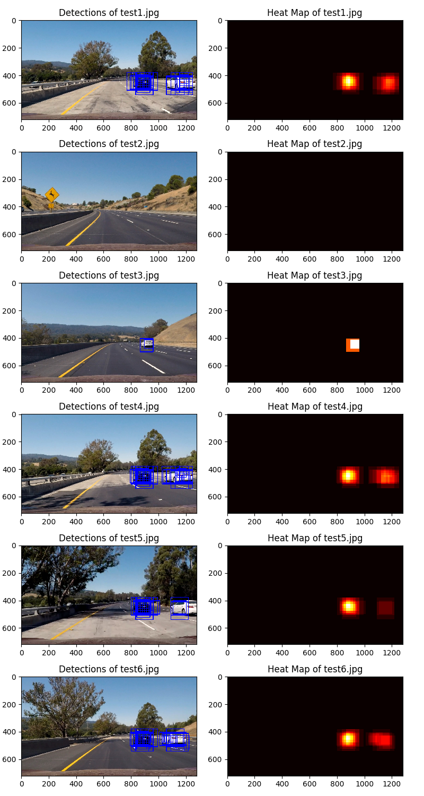
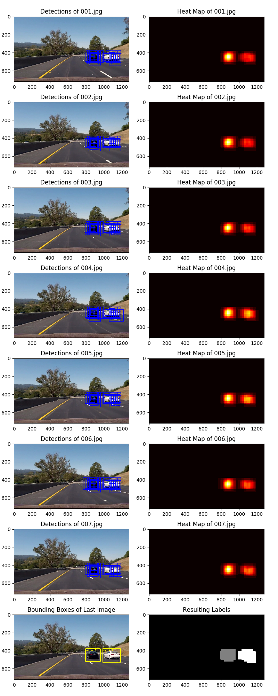

# Vehicle Detection Project

The goals / steps of this project are the following:

* Perform a Histogram of Oriented Gradients (HOG) feature extraction on a labeled training set of images and train a classifier Linear SVM classifier
* Optionally, you can also apply a color transform and append binned color features, as well as histograms of color, to your HOG feature vector. 
* Note: for those first two steps don't forget to normalize your features and randomize a selection for training and testing.
* Implement a sliding-window technique and use your trained classifier to search for vehicles in images.
* Run your pipeline on a video stream (start with the test_video.mp4 and later implement on full project_video.mp4) and create a heat map of recurring detections frame by frame to reject outliers and follow detected vehicles.
* Estimate a bounding box for vehicles detected.

## [Rubric](https://review.udacity.com/#!/rubrics/513/view) Points
###Here I will consider the rubric points individually and describe how I addressed each point in my implementation.  

---
### Writeup / README

#### 1. Provide a Writeup / README that includes all the rubric points and how you addressed each one.  You can submit your writeup as markdown or pdf.  [Here](https://github.com/udacity/CarND-Vehicle-Detection/blob/master/writeup_template.md) is a template writeup for this project you can use as a guide and a starting point.  

You're reading it!

### Histogram of Oriented Gradients (HOG)

#### 1. Explain how (and identify where in your code) you extracted HOG features from the training images.
The training images are loaded by the classifier class `TClassifier` defined in `classifier.py`. The class constructor recursively searches the provided directories with vehicle and non-vehicle images of resolution 64x64, then loads and labels the samples. Here's an example of vehicle and non-vehicle images:

    

After loading the samples, the `TClassifier` constructor extracts HOG, spatial and color histogram features of each sample image using function `ExtractFeatures()` located in `feature_extraction.py`. The function essentially combines features extracted by three different methods:
* `GetHogFeatures()`: Extracts HOG features of the image channel using `skimage.feature.hog()`
* `GetSpatialFeatures()`: Extracts spatial features of the image
* `GetColorHistFeatures()`: Extracts color histogram features of the image

Here is an example using the YCrCb color space, HOG parameters of 9 orientations, 8 px per cell, 2 cells per block, spatial size 32x32 and 32 color histogram bins:

    

#### 2. Explain how you settled on your final choice of HOG parameters.
I explored multiple color spaces and came up with the following rank of color spaces when training and testing the classifier with a single type (average test accuracy after 5-10 runs is shown in parentheses):

| Feature Type | 1st place    | 2nd place      | 3rd place      |
|--------------|--------------|----------------|----------------|
| HOG          | HSV (0.9847) | HLS (0.9828)   | YCrCb (0.9809) |
| Spatial      | RGB (0.8906) | YCrCb (0.8811) | YUV (0.8802)   |
| Histogram    | HSV (0.9143) | HLS (0.9135)   | YCrCb (0.8915) |

First I tried different combination of the winning color spaces for concatenated HOG-Spatial-Histogram features: HSV-RGB-HSV, HLS-YCrCb-HLS and others. The test accuracy on the training set reached 0.9920, but the performance on the project video appeared to be bad: the guard rail on the bridge at 0:22-0.25s was stably falsely detected as a vehicle by windows of different sizes. Then I decided to pick YCrCb, which is the only winning color space in all three categories, for all types of features. The testing accuracy decreased a bit to 0.9900, but the number of false detections on the project video decreased significantly.

Also I experimented with other meta parameters:
* HOG parameters: number of orientations appeared to be good in range 7-9, cells per block is 2. Decreasing the values reduces accuracy significantly; increasing it doesn't improve accuracy, but affects performance.
* Spatial sizes 16x16, 32x32 and 48x48 are almost equally good.
* Color histogram, number of bins is only good as 32. Decreasing it affect accuracy; increasing doesn't improve anything, but affects performance.

#### 3. Describe how (and identify where in your code) you trained a classifier using your selected HOG features (and color features if you used them).
The classifier is implemented in `TClassifier` class defined in `classifier.py`. I used `sklearn.svm.LinearSVC` classifier trained with [vehicle](https://s3.amazonaws.com/udacity-sdc/Vehicle_Tracking/vehicles.zip) and [non-vehicle](https://s3.amazonaws.com/udacity-sdc/Vehicle_Tracking/non-vehicles.zip) sample images combined of [GTI](http://www.gti.ssr.upm.es/data/Vehicle_database.html) and [KITTI](http://www.cvlibs.net/datasets/kitti/) databases. The training and testing of the classifier is done right after normalizing the feature vectors in the end of `TClassifier` constructor.

---
### Sliding Window Search

#### 1. Describe how (and identify where in your code) you implemented a sliding window search.  How did you decide what scales to search and how much to overlap windows?
The sliding window search is implemented in the private class method `TVehicleTracker::GetBoundingBoxes()` defined in `vehicle_tracker.py`. The method is able to handle multiple window sizes by scaling the image down while maintaining the same base window size of 64x64 px. This approach makes possible computing expensive HOG features once per whole image (per scale) and deriving HOG features of each window out of the whole image HOG features.
I decided to search square windows of three sizes - 64, 96, 128 pixels - reliably capturing vehicles located far away with 64px windows, nearby vehicles with 128px windows, and everything in between with all three windows sizes. The corresponding scales for the base 64x64 window (see constant `TVehicleTracker::WINDOW_SIZE_PX`) are 1.0, 1.5, 2.0 defined by constant `TVehicleTracker::SCALES`. These multiple scales along with 75% overlapping produce a dense cluster of detection boxes on each vehicle, which makes the final vehicle detection easier by appying a heat map technique. The 75% window overlapping is defined by constant `TVehicleTracker::CELLS_PER_STEP = 2`, which is devided by window size in cells (8) resulting in 2/8=0.25 step, 0.75 overlapping.

#### 2. Show some examples of test images to demonstrate how your pipeline is working.  What did you do to optimize the performance of your classifier?
I searched on three scales (64, 96, 128 pixels) using YCrCb 3-channel HOG features plus spatially binned color and histograms of color in the feature vector, which provided a nice result. Also I tried to apply a heat map threshold (2+) to static images, assuming there are multiple detections of each vehicle in overlapping windows of different size. I works well with the test images (see below), but fails on distant vehicles, which are detected by a single window only. The static heat map has been replaced with a dynamic heat map history in the final variant of the project. See the pipeline performance on the test images:

    

---
### Video Implementation

#### 1. Provide a link to your final video output.  Your pipeline should perform reasonably well on the entire project video (somewhat wobbly or unstable bounding boxes are ok as long as you are identifying the vehicles most of the time with minimal false positives.)
Here's a [link to my video result](https://youtu.be/cGvuKVzHfnY)

#### 2. Describe how (and identify where in your code) you implemented some kind of filter for false positives and some method for combining overlapping bounding boxes.

I implemented a simplistic, yet reliable solution to track detected vehicles, filter out false positives and produce smoothed bounding boxes. There are two parts of the solution:
1) `TVehicleTracker` class implements a "historical" heat map over last 8 frames of the video stream. The heat map is computed every frame as a sum of "historical" bounding boxes, see `GetHistoricalBoundingBoxes()`. The resulting heat map is thresholded by number of samples in the history (up to 8), and passed to `scipy.ndimage.measurements.label()` in order to identify independent connected components, presumably representing vehicles, see `GetLabels()`. The heat map history length of 8 is enough for producing reliable car detections, and not too long to produce "trails" of moving vehicles. This approach filters out most false positives, but the toughest ones handled in other way.
2) `TVehicle` class implements the second stage of vehicle detection and tracking, given the "historical" bounding boxes produced by `TVehicleTracker`. An instance of `TVehicle` is created by method `TVehicleTracker::UpdateVehicles()` for each valid bounding box not accepted by any existing `TVehicle` instance. A bounding box is considered invalid, if any of its dimensions is below 48 px. An updated bounding box is accepted by a `TVehicle` instance in method `UpdateVehicle()`, if the distance between the vehicle center and the new bounding box center is below 128 px. In case of multiple occurences, only the closest bounding box is taken. `TVehicle` maintains a history of recent bounding boxes, computing the average boinding box, see `TVehicle::GetBoundingBox()`. A new `TVehicle` instance is not considered a true vehicle until the lock is acquired (state `LOCKED`), which happens only when there are 12 bounding boxes in the history. The value of 12 is chosen as half of the project video frame rate (25fps), meaning each vehicle is detected within 0.5s. This time is enough for a reliable detection of a real vehicle, but not that long for missing a danger. If the frame doesn't containg matching detections, the history truncates and the vehicle state changes to `LOCKING`. Once the history gets empty, the vehicles is considered lost (state `UNLOCKED`) and gets removed.

The two-stage approach demontstrated a pretty good reliability and robustness to false positives. The following picture shows the result of processing a sequence of 7 stream pictures, using the approach above with a 7-frame `TVehicle` history:

    

The execution log:
`(carnd-term1) Yurys-MacBook-Pro:vehicle_detection vernor$ python test.py vehicle_tracking --in_img "test_images/0*.jpg" --out_img examples/vehicle_tracking.png
Loading classifier data
Processing 001.jpg
Creating nameless vehicle object with box ((800, 380), (959, 523))
Creating nameless vehicle object with box ((984, 380), (1183, 523))
Checking vehicle Id 0, state LOCKING
Checking vehicle Id 0, state LOCKING
Processing 002.jpg
Updated vehicle Id 0, history length 2, best box ((800, 380), (959, 523))
Updated vehicle Id 0, history length 2, best box ((984, 380), (1183, 523))
Checking vehicle Id 0, state LOCKING
Checking vehicle Id 0, state LOCKING
Processing 003.jpg
Updated vehicle Id 0, history length 3, best box ((792, 380), (959, 523))
Updated vehicle Id 0, history length 3, best box ((984, 380), (1183, 523))
Checking vehicle Id 0, state LOCKING
Checking vehicle Id 0, state LOCKING
Processing 004.jpg
Updated vehicle Id 0, history length 4, best box ((792, 380), (959, 523))
Updated vehicle Id 0, history length 4, best box ((984, 380), (1183, 539))
Checking vehicle Id 0, state LOCKING
Checking vehicle Id 0, state LOCKING
Processing 005.jpg
Updated vehicle Id 0, history length 5, best box ((792, 380), (959, 523))
Updated vehicle Id 0, history length 5, best box ((984, 380), (1183, 539))
Checking vehicle Id 0, state LOCKING
Checking vehicle Id 0, state LOCKING
Processing 006.jpg
Updated vehicle Id 0, history length 6, best box ((792, 380), (959, 523))
Updated vehicle Id 0, history length 6, best box ((984, 380), (1183, 539))
Checking vehicle Id 0, state LOCKING
Checking vehicle Id 0, state LOCKING
Processing 007.jpg
Updated vehicle Id 0, history length 7, best box ((792, 380), (959, 523))
Updated vehicle Id 0, history length 7, best box ((984, 380), (1183, 539))
Checking vehicle Id 0, state LOCKED
Creating vehicle Id 1
Vehicle Ids {1}
Checking vehicle Id 0, state LOCKED
Creating vehicle Id 2
Vehicle Ids {1, 2}
2 vehicles found`

---
### Discussion

####1. Briefly discuss any problems / issues you faced in your implementation of this project.  Where will your pipeline likely fail?  What could you do to make it more robust?

Here I'll talk about the approach I took, what techniques I used, what worked and why, where the pipeline might fail and how I might improve it if I were going to pursue this project further.  

