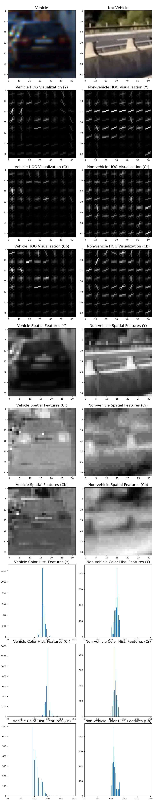

# Vehicle Detection Project

The goals / steps of this project are the following:

* Perform a Histogram of Oriented Gradients (HOG) feature extraction on a labeled training set of images and train a classifier Linear SVM classifier
* Optionally, you can also apply a color transform and append binned color features, as well as histograms of color, to your HOG feature vector. 
* Note: for those first two steps don't forget to normalize your features and randomize a selection for training and testing.
* Implement a sliding-window technique and use your trained classifier to search for vehicles in images.
* Run your pipeline on a video stream (start with the test_video.mp4 and later implement on full project_video.mp4) and create a heat map of recurring detections frame by frame to reject outliers and follow detected vehicles.
* Estimate a bounding box for vehicles detected.

[//]: # (Image References)
[image1]: ./examples/class_examples.png
[image2]: ./examples/feature_extraction.png
[image3]: ./examples/sliding_windows.jpg
[image4]: ./examples/sliding_window.jpg
[image5]: ./examples/bboxes_and_heat.png
[image6]: ./examples/labels_map.png
[image7]: ./examples/output_bboxes.png
[video1]: ./project_video.mp4

## [Rubric](https://review.udacity.com/#!/rubrics/513/view) Points
###Here I will consider the rubric points individually and describe how I addressed each point in my implementation.  

---
### Writeup / README

#### 1. Provide a Writeup / README that includes all the rubric points and how you addressed each one.  You can submit your writeup as markdown or pdf.  [Here](https://github.com/udacity/CarND-Vehicle-Detection/blob/master/writeup_template.md) is a template writeup for this project you can use as a guide and a starting point.  

You're reading it!

### Histogram of Oriented Gradients (HOG)

#### 1. Explain how (and identify where in your code) you extracted HOG features from the training images.

The training images are loaded by the classifier class `TClassifier` defined in `classifier.py`. The class constructor recursively searches the provided directories with vehicle and non-vehicle images of resolution 64x64, then loads and labels the samples. Here's an example of vehicle and non-vehicle images:

    

After loading the samples, the `TClassifier` constructor extracts HOG, spatial and color histogram features of each sample image using function `ExtractFeatures()` located in `feature_extraction.py`. The function essentially combines features extracted by three different methods:
* `GetHogFeatures()`: Extracts HOG features of the image channel using `skimage.feature.hog()`
* `GetSpatialFeatures()`: Extracts spatial features of the image
* `GetColorHistFeatures()`: Extracts color histogram features of the image

Here is an example using the YCrCb color space, HOG parameters of 9 orientations, 8 px per cell, 2 cells per block, spatial size 32x32 and 32 color histogram bins:

    

#### 2. Explain how you settled on your final choice of HOG parameters.

I explored multiple color spaces and came up with the following rank of color spaces when training and testing the classifier with a single type (average test accuracy after 5-10 runs is shown in parentheses):

| Feature Type | 1st place    | 2nd place      | 3rd place      |
|--------------|--------------|----------------|----------------|
| HOG          | HSV (0.9847) | HLS (0.9828)   | YCrCb (0.9809) |
| Spatial      | RGB (0.8906) | YCrCb (0.8811) | YUV (0.8802)   |
| Histogram    | HSV (0.9143) | HLS (0.9135)   | YCrCb (0.8915) |

First I tried different combination of the winning color spaces for concatenated HOG-Spatial-Histogram features: HSV-RGB-HSV, HLS-YCrCb-HLS and others. The test accuracy on the training set reached 0.9920, but the performance on the project video appeared to be bad: the guard rail on the bridge at 0:22-0.25s was stably falsely detected as a vehicle by windows of different sizes. Then I decided to pick YCrCb, which is the only winning color space in all three categories, for all types of features. The testing accuracy decreased a bit to 0.9900, but the number of false detections on the project video decreased significantly.

Also I experimented with other meta parameters:
* HOG parameters: number of orientations appeared to be good in range 7-9, cells per block is 2. Decreasing the values reduces accuracy significantly; increasing it doesn't improve accuracy, but affects performance.
* Spatial sizes 16x16, 32x32 and 48x48 are almost equally good.
* Color histogram, number of bins is only good as 32. Decreasing it affect accuracy; increasing doesn't improve anything, but affects performance.

#### 3. Describe how (and identify where in your code) you trained a classifier using your selected HOG features (and color features if you used them).

The classifier is implemented in `TClassifier` class defined in `classifier.py`. I used `sklearn.svm.LinearSVC` classifier trained with [vehicle](https://s3.amazonaws.com/udacity-sdc/Vehicle_Tracking/vehicles.zip) and [non-vehicle](https://s3.amazonaws.com/udacity-sdc/Vehicle_Tracking/non-vehicles.zip) sample images combined of [GTI](http://www.gti.ssr.upm.es/data/Vehicle_database.html) and [KITTI](http://www.cvlibs.net/datasets/kitti/) databases. The training and testing of the classifier is done right after normalizing the feature vectors in the end of `TClassifier` constructor.

### Sliding Window Search

#### 1. Describe how (and identify where in your code) you implemented a sliding window search.  How did you decide what scales to search and how much to overlap windows?

The sliding window search is implemented in the private class method `TVehicleTracker::GetBoundingBoxes()` defined in `vehicle_tracker.py`. The method is able to handle multiple window sizes by scaling the image down while maintaining the same base window size of 64x64 px. This approach makes possible computing expensive HOG features once per whole image (per scale) and deriving HOG features of each window out of the whole image HOG features.

#### 2. Show some examples of test images to demonstrate how your pipeline is working.  What did you do to optimize the performance of your classifier?

Ultimately I searched on two scales using YCrCb 3-channel HOG features plus spatially binned color and histograms of color in the feature vector, which provided a nice result.  Here are some example images:

![alt text][image4]
---

### Video Implementation

####1. Provide a link to your final video output.  Your pipeline should perform reasonably well on the entire project video (somewhat wobbly or unstable bounding boxes are ok as long as you are identifying the vehicles most of the time with minimal false positives.)
Here's a [link to my video result](./project_video.mp4)

####2. Describe how (and identify where in your code) you implemented some kind of filter for false positives and some method for combining overlapping bounding boxes.

I recorded the positions of positive detections in each frame of the video.  From the positive detections I created a heatmap and then thresholded that map to identify vehicle positions.  I then used `scipy.ndimage.measurements.label()` to identify individual blobs in the heatmap.  I then assumed each blob corresponded to a vehicle.  I constructed bounding boxes to cover the area of each blob detected.  

Here's an example result showing the heatmap from a series of frames of video, the result of `scipy.ndimage.measurements.label()` and the bounding boxes then overlaid on the last frame of video:

### Here are six frames and their corresponding heatmaps:

![alt text][image5]

### Here is the output of `scipy.ndimage.measurements.label()` on the integrated heatmap from all six frames:
![alt text][image6]

### Here the resulting bounding boxes are drawn onto the last frame in the series:
![alt text][image7]

---

###Discussion

####1. Briefly discuss any problems / issues you faced in your implementation of this project.  Where will your pipeline likely fail?  What could you do to make it more robust?

Here I'll talk about the approach I took, what techniques I used, what worked and why, where the pipeline might fail and how I might improve it if I were going to pursue this project further.  

